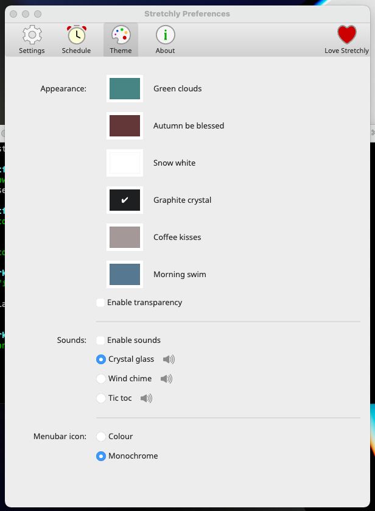

# Stefan's dotfiles

Type

```
git
```

Then install "Command Dine Developer Tools" in the window it shows you.

```
git clone https://github.com/nirtamir2/dotfiles.git
```

After that - install homebrew.

```
/bin/bash -c "$(curl -fsSL https://raw.githubusercontent.com/Homebrew/install/HEAD/install.sh)"
```

Now add the 2 commands from the installation output of brew to your path. If everything is ok, you can start type brew.

Make dotfiles executable by running `chmod 755 ./dotfiles`

Now run ```./dotfiles install```

It will ask you about your Apple ID. If you migrate from another computer, it will send a notification for 2FA — so make sure to unlink your computer by navigating into appleid.apple.com and unlink this computer - so you get 2fa by text message.

It may fail to install macOS Apple Store apps.
Then it will create the software update for you.
If this stuck in downloading software update, so you can terminate this script and do it later...
It will continue installing stuff.

If you are in work computer - consider running manually `scripts/work-only.sh`

Now login to icloud in your mac.
Now restore stuff with `mackup`.
Run `vi ~/mackup.cfg`
Paste 
```
[storage]
engine = icloud
directory = dotfiles/backup
```
Now exit and save with `ctrl+c` and `:wq`.
Run `mackup -r restore`

Now cd this repo and try to run `dotfiles install-zsh-symlinks-only`

Run `scripts/node.sh`
--- 

Then run brew-installs.sh This will take time...

If you have problems install app store apps, you can install them manually. For example: if the command
was `mas install 994933038` navigate to:
https://apps.apple.com/us/app/id<THE_ID>
and install the app

Make brew-casks.sh executable by running `chmod 755 brew-cask.sh`
Now run ```./brew-cask.sh```

Now install fonts here by opening the `static/fira-code-iscript` and install them manually.

Make key repeat the fastest and the delay the shortest (in ui because the command does not work).

Now start raycast. In the ui - disable spotlight key - like in .

Now map raycast key to spotlight key cmd + space.

karabiner-elements - use https://ke-complex-modifications.pqrs.org/#right_option_to_hyper recipe - Right Option Key → Hyper Key (⌃⌥⇧⌘)
I created a repository with my config https://github.com/nirtamir2/karabiner but I may move it here

Now open fig. install it. And remember to run

```
fig settings telemetry.disabled true
```

To remove tracking

Now install the regular install script - for oh-my-zsh
now copy the zshrc file in this repo to the .zshrc file in your home directory.

git clone https://github.com/chrisands/zsh-yarn-completions ~/.oh-my-zsh/custom/plugins/zsh-yarn-completions
If missing
BTW - is missing admin rights use sudo -v before running the command

Now run chrome and login with your user. Remember to disable analytics and put chrome as default browser.

for missing zsh-yarn-completions


make everything in command.bin executable by running `chmod 755 <filename>` for each file
make dotfiles.sh executable by running `chmod 755 dotfiles.sh`

Now run dotfiles install

Follow those images abd change accordingly:
##### Homerow
[homerow](./manual-install/homerow.md)
##### google translate chrome extension

##### keyboard:

##### language:

##### raycast:
 
##### trackpad:

##### Disable quick notes when mouse is in the corner
Settings -> Desktop & Dock -> Hot Corners... remove everything

##### stretchly:
You need to open finder -> search for stretchly in applications. CTRL+click open because the app is not signed


##### Shortcuts disable:
In order to remove conflicts with webstorm IDE you need to disable some shortcuts
Disable everything in this section of services / remove the key bindings


Download https://www.nerdfonts.com/font-downloads fira-code-nerd-font for starship
JetbrainsMono Nerd Font for nvchad


## How to get started

```
# install stuff and link config files
~/path/to/dotfiles/dotfiles install

# back up config files
~/path/to/dotfiles/dotfiles backup
```

## What's included

- Alfred preferences
- brew dependencies
- iTerm2 config
- npm config and dependencies
- shell functions
- VSCode config and plugins
- zsh config and aliases

## Notes

### Alfred workflows

Alfred workflows are included in `.gitignore`. These will be installed in `node.sh` via npm packages.


## TODO
Raycast commands - better


## Extensions config
### Vimium chrome extension
# Insert your preferred key mappings here.
```
unmapAll
map f LinkHints.activateMode
map F LinkHints.activateModeToOpenInNewTab
```

### Google Translate
Open popup immediately

### GNU Stow - manage symlinks better
https://www.jakewiesler.com/blog/managing-dotfiles