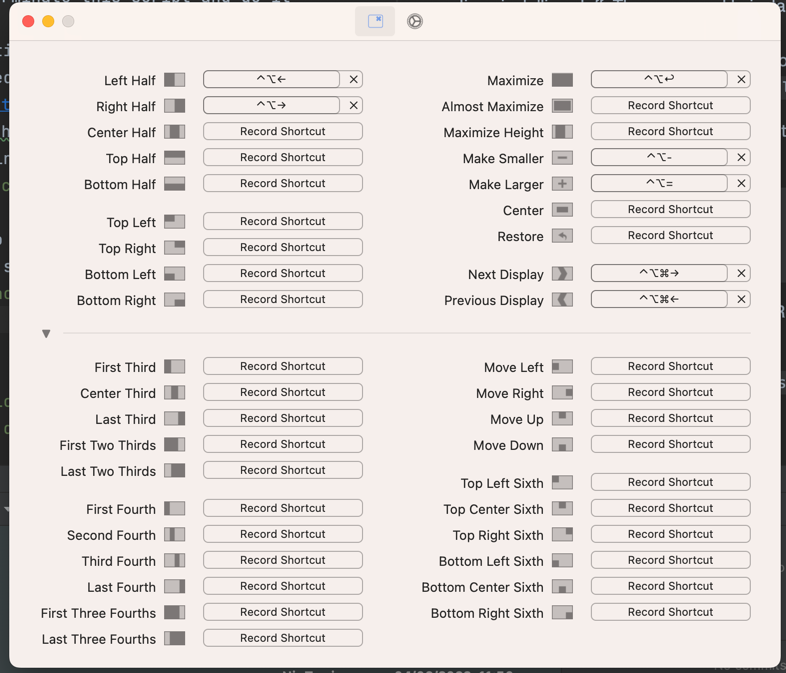

# Stefan's dotfiles

Type

```
git
```

Then install "Command Dine Developer Tools" in the window it shows you.

```
git clone https://github.com/nirtamir2/dotfiles.git
```

After that - install homebrew.

```
/bin/bash -c "$(curl -fsSL https://raw.githubusercontent.com/Homebrew/install/HEAD/install.sh)"
```

Now add the 2 commands from the installation output of brew to your path. If everything is ok, you can start type brew.

Make brew-installs.sh executable by running `chmod 755 ./brew-installs.sh`

Now run ```./brew-installs.sh```

Then run brew-installs.sh This will take time...

If you have problems install app store apps, you can install them manually. For example: if the command
was `mas install 994933038` navigate to:
https://apps.apple.com/us/app/id<THE_ID>
and install the app

Make brew-casks.sh executable by running `chmod 755 brew-cask.sh`
Now run ```./brew-cask.sh```

Now install fonts here by opening the `static/fira-code-iscript` and install them manually.

Make key repeat the fastest and the delay the shortest (in ui because the command does not work).

Now start raycast. In the ui - disable spotlight key - like in .

Now map raycast key to spotlight key cmd + space.

Now open fig. install it. And remember to run

```
fig settings telemetry.disabled true
```

To remove tracking

Now install nodejs and yarn with volta

```
curl https://get.volta.sh | bash
```

And then (when we have volta installed) run
```volta install node yarn```

Now install the regullar install script - for oh-my-zsh
now copy the zshrc file in this repo to the .zshrc file in your home directory.

git clone https://github.com/chrisands/zsh-yarn-completions ~/.oh-my-zsh/custom/plugins/zsh-yarn-completions
If missing
BTW - is missing admin rights use sudo -v before running the command

Now run chrome and login with your user. Remember to disable analytics and put chrome as default browser.

for missing zsh-yarn-completions


make everything in command.bin executable by running `chmod 755 <filename>` for each file
make dotfiles.sh executable by running `chmod 755 dotfiles.sh`

Now run dotfiles install

Follow those images abd change accordingly:
##### google translate chrome extension

##### keyboard:

##### language:

##### raycast:

##### rectangle:

##### trackpad:

##### stretchly:
You need to open finder -> search for stretchly in applications. CTRL+click open because the app is not signed


##### Shortcuts disable:
In order to remove conflicts with webstorm IDE you need to disable some shortcuts
Disable everything in this section of services / remove the key bindings


Download https://www.nerdfonts.com/font-downloads fira-code-nerd-font for starship


## How to get started

```
# install stuff and link config files
~/path/to/dotfiles/dotfiles install

# back up config files
~/path/to/dotfiles/dotfiles backup
```

## What's included

- Alfred preferences
- brew dependencies
- iTerm2 config
- npm config and dependencies
- shell functions
- VSCode config and plugins
- zsh config and aliases

## Notes

### Alfred workflows

Alfred workflows are included in `.gitignore`. These will be installed in `node.sh` via npm packages.
