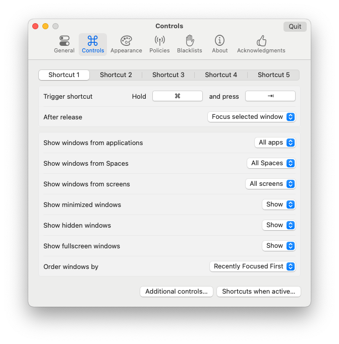
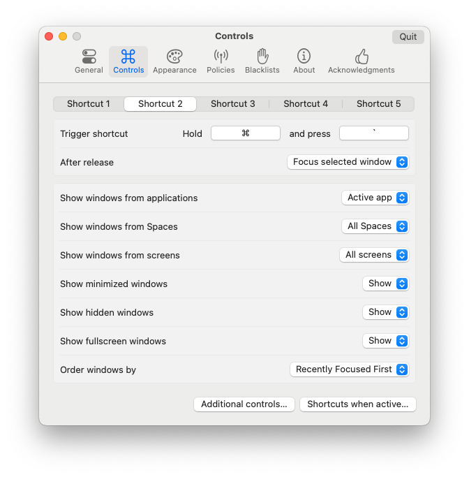
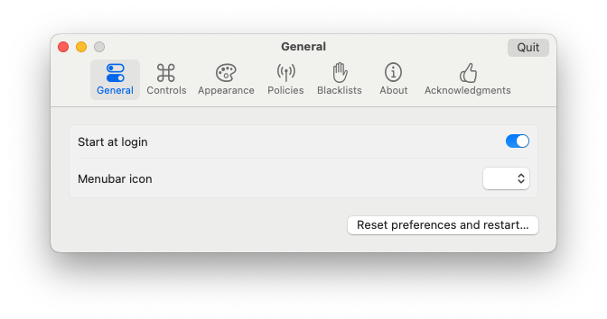
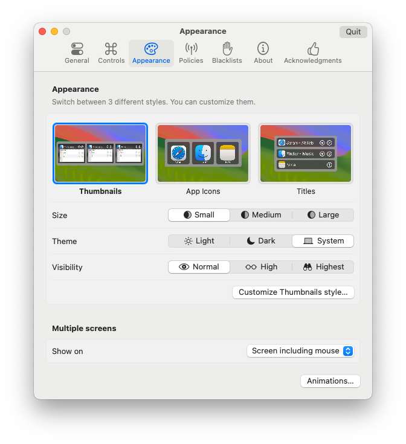

# AltTab - Windows alt-tab on macOS
```sh
brew install --cask alt-tab
```

Then - change the keys to `⌘` + `⇥`   



or `⌘` + "`"



And then - remove tray icon 



Show on Screen including mouse

